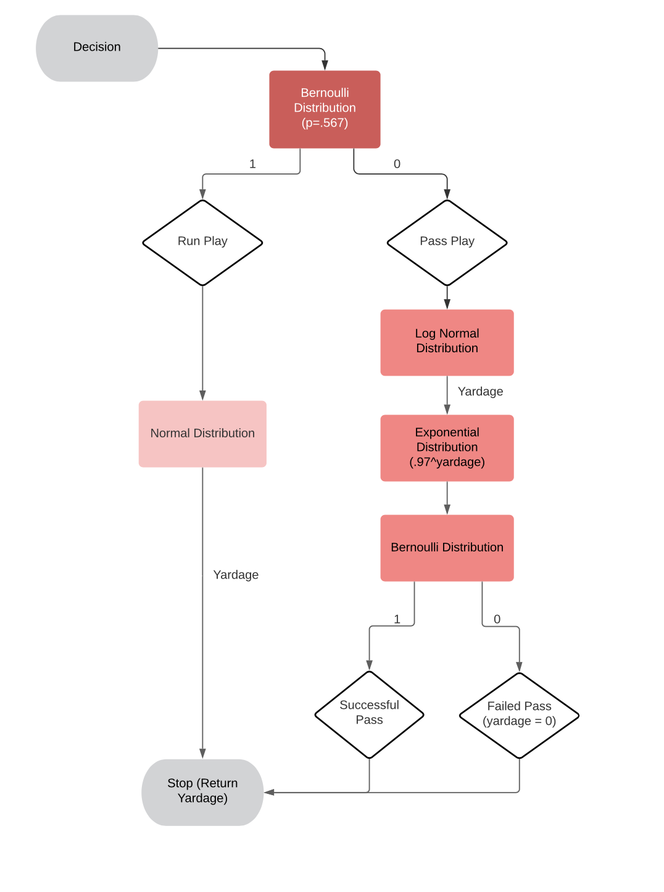

```{r setup, include=FALSE}
knitr::opts_chunk$set(echo = TRUE)
library(Rlab)
library(sportyR)
```
```{r, echo = FALSE}
geom_football(league = "NCAA",  rotation_dir = "ccw")
```

## Introduction 

The game of football is an interesting, yet complex game to assess through statistics. Probability and variable distributions are required to represent every aspect of the game. Football consists of two teams with eleven players on the field at a time. The objective is for the offense (the team in possession of the ball) to run a series of plays to reach the endzone for a touchdown. The offense not only has to reach the endzone, but they also have to travel at least ten yards every four plays (to reach a “first down”) during their drive. The term “drive” refers to the series of plays while the offense has the ball. A drive results in either a success (touchdown) or failure (they did not surpass ten yards in four plays). For the scope of this project, the focus narrows only on the offensives drives in two main aspects. First, the play decision probability (run or pass) by the quarterback or offensive coordinator and its affect to the outcome of both the play and the drive. More specifically, the analysis regards how the parameters of the distribution representing the decision of play effects the success of this play (the yardage gained or lost). Second, the talent of the team to carry out either the run or the pass plays and gain the greatest number of yards. This is represented by a change of the parameters in the run and pass random variable distributions. An in-depth analysis for both of these observations factors is explain in the methods and results below. 

Certain assumptions are established prior to the simulation to simplify and maintain consistency in the project. First, all drives start at the 25-yard-line as a result of a touchback. Therefore, the offense has to gain at least 75 yards to reach a touchdown. Next, the offense will get four downs (or attempts) to reach the first down. While most of the time the offense will choose to punt the ball to the other team on the last down, this assumption allows for a drive to end in a measurable failure. There is also the possibility that if the offense is on the fourth down and within a certain range of the endzone, they will choose to kick a field goal for half the points of a touchdown. Since the project focuses on touchdowns, the assumption that there are no field goals maximizes the opportunity for the team to reach a touchdown. Finally, the offense could unexpectedly lose possession of the ball during the drive. This could be caused by either a fumble (an offensive player drops the ball, and the defense takes it) or an interception (a pass is caught by the defense). The project does not account for the probability of a fumble or interception, but this (and all the assumptions mentioned) could be considered for future work on this simulation.  

## Methods

For our simulation, we first created a list called state with four elements: down, downyards, totyards, and totdowns for the current down before the next first down (1- 4 rotation), the number of yards gained or lost in the current down before the next first down, a running total of yards gained or lost in the play (all the downs), and a running total of the number of plays (total number of downs), respectively. Each of these elements is initially set to 0 except for down, as a team cannot be on down 0.  

The function titled “play” determines the number of yards the team will gain or lose in a given play. This function begins with the decision to perform a running or passing play, which is determined by a Bernoulli distribution with a probability of .567 for a running play (Figure.1). Based on experience at football games and background research, it was found that run plays will slightly be chosen more over run plays. We decided that offsetting the probability to .567 was the best way to represent this. If this distribution returns a 1, the decision is a running play, and a yardage is returned from a normal distribution with mean 3 and standard deviation 3 (Figures 2a and 2b). In a running play, a team may gain or lose yardage. This is represented by a normal distribution with a mean and standard deviation set to three. After this play is chosen and the yardage is obtained, the “state” list is updated accordingly and checked to see if there is a touchdown or if the team runs out of downs. 

If the decision is a passing play - that is, the Bernoulli distribution returns a 0 - a yardage is returned from a log normal distribution with mean log (10) and standard deviation 1 (Figure.3a). For a passing play, yardage will always result in a positive number between 3 and 75. Given the yardage is within this range, a probability of success is then assigned to the pass, using an exponential function. This uses .97 as the base and the random variable yardage as the exponent. This makes smaller passes very likely and longer passes less likely, as shown in Figure.3c. We created a variable called “complete_check” to determine the result of the passing play from a Bernoulli distribution with the resulting probability of the exponential function. If “complete_check” returns a 1, then the passing play is successful, and the yardage is returned from the play function. If “complete_check” returns a 0, the passing play is unsuccessful, and the returned yardage is 0.  



A function titled “drive” encompasses a simulation of a series of plays until a success (touchdown) or failure (ran out of downs before a first down). Drive keeps track of the “state” elements and changes them as the drive continues. Drive will run until there is a success or failure, continuing as long as the downs count is less than or equal to 4 and the total yards are less than 75. The results of the play function are assigned to a variable named “yards,” which are added to the state elements “downyards” and “totyards” as the drive continues. Drive stops under 2 conditions only: 1) a touchdown, as in total yards reach or pass 75, or 2) a failure, as in 10 yards are not reached in the rotation of four plays. The project is the replication of the “drive” function many times for data analysis of the final results.  

We decided to change various aspects of our project to see how the outcomes are affected. First, we simulated only running plays to see how the probability of a touchdown changes, and then did the same for passing plays. While unrealistic of a game of football, we were simply interested in the significance of one play over the other in the project. Next, we changed the mean and base parameters of the run and pass distributions to assess their influence on the touchdown probability.   

## Results

To begin, we sampled from a Bernoulli Distribution with probability of that a decision is a run play (==1) is .567.The decision to choose a run play follows a Bernoulli distribution with the probability of choosing a run set to .567. Figure.1 below shows this distribution and confirms that a run play will be chosen slightly more times than a pass play.

```{r, echo = FALSE}

hist(replicate(1000, rbern(1, .567)), main = ' Figure.1 : Histogram of Decision Bernoulli', xlab = 'Decision (1 == Run Play)')

```

The run play yardage is sampled from a normal distribution with mean 3 and standard deviation 3 (numbers are rounded to the nearest whole number). 
Figure.2a shows the spread of the random sample data points. Figure.2b shows the pdf of the normal distribution given the chosen parameters.

```{r, echo = FALSE}

#Figure.2a
x <- seq(1, 1000, 1)
y <- replicate(1000, round(rnorm(1, mean = 3, sd = 3)))
plot(x,
     y,
     main = 'Figure.2a Spread of Possible Run Yardages',
     ylab = 'Yardage',
     xlab = 'Play Number')
abline(h = 3, col = 'red')

#Figure.2b
i <- seq(-10, 10, .01)
#plot(dnorm(i, mean = 3, sd = 3), main = "Run Play Normal PDF", ylab = 'Density')
plot(
   i,
   dnorm(i, mean = 3, sd = 3),
   type = "l",
   main = "Figure.2b Run Play Normal PDF",
   lwd = 2,
   xlab = "",
   ylab = 'Density'
)
abline(v = 3, col = 'red')

```

The pass play yardage is sampled from a log normal distribution with mean log(10) and standard deviation 1 (numbers are rounded to the nearest whole number). The spread and pdf are shown in Figures 3a and 3b, respectively. The yardage is then the exponent variable in an exponential distribution to find the probability of success represented in Figure.3c. This probability is used as the parameter in a Bernoulli PDF to find whether the pass was completed or not. 

```{r, echo = FALSE}

#Figure.3a
x <- seq(1, 1000, 1)
y <- replicate(length(x), rlnorm(1, mean = log(10), sd = 1))
plot(
   x,
   y,
   main = 'Figure.3a : Spread of Possible Pass Yardages',
   ylab = 'Yardage',
   xlab = 'Play Number',
   ylim = c(0, 75)
)
abline(h = 75, col = 'blue')
abline(h = 3, col = 'blue')

#Figure.3b
i <- seq(0, 75, .1)
plot(
   i,
   dlnorm(i, mean = log(10), sd = 1),
   type = "l",
   main = "Figure.3b : Pass Play Log - Normal PDF",
   lwd = 2,
   xlab = "",
   ylab = 'Density',
   xlim = c(0, 70)
)
abline(v = log(10), col = 'red')

#Figure.3c
x_comp <- seq(3, 75, 1)
y_comp <- .97 ^ (x_comp)
plot(
   x_comp,
   y_comp,
   type = 'l',
   main = "Figure.3c : Probability of Completing a Pass Given its Length",
   xlab = "Yardage",
   ylab = "Completion Probability"
)

```

Using the original distributions and parameters, the probability to score a touchdown on a given drive is approximately .35. If a drive results in a touchdown, the average total number of plays it took is approximately 4.3. In all tests, the number of simulations is set equal to 10,000. 

```{r, echo = FALSE}

state <- list()
state$down <- 1
state$downyards <- 0
state$totyards <- 0
state$totdowns <- 0 

play <- function() {
   decision <- rbern(1, .567)
   if (decision == 1L) {
      yardage <- round(rnorm(1, mean = 3, sd = 3))
      return(yardage)
   } else {
      yardage <- 0
      while ((yardage < 3) | (yardage > 75)) {
         yardage <- rlnorm(1, mean = log(10), sd = 1)
         yardage <- round(yardage)
      }
      #Given his pass is of length 'yardage,'
      #what is the probability that he can complete a pass of this length?
      p_comp <- .97 ^ (yardage)
      complete_check <- rbern(1, prob = p_comp)
      if (complete_check == 1) {
         return(yardage)
      } else {
         yardage <- 0
         return (yardage)
      }
   }
}

drive <- function() {
   state$down <- 1
   state$downyards <- 0
   state$totyards <- 0
   state$totdowns <- 0
   #while total yards is less than 75 and down is less than 5
   while ((state$totyards < 75) & (state$down <= 4)) {
      yards <- play()
      
      state$down <- state$down + 1
      state$downyards <-  state$downyards + yards
      state$totyards <- state$totyards + yards
      state$totdowns <-  state$totdowns + 1
      
      if (state$totyards >= 75) {
         break
      } else if (state$downyards >= 10) {
         state$down <- 1
         state$downyards <- 0
      } else if (state$down > 4) {
         break
      }
   }
   return(state)
}

nsim <- 10000
t_yrds <- c(replicate(nsim, 0))
t_plays <- c(replicate(nsim, 0))
for (i in 1:nsim) {
   j <- drive()
   t_yrds[i] <- j$totyards
   t_plays[i] <- j$totdowns
}

td <- 0
plays_cnt <- 0
td_idx <- which(t_yrds >= 75)
for (i in t_yrds) {
   if (i >= 75) {
      td = td + 1
   }
}

for (t in td_idx) {
   plays_cnt <- plays_cnt + t_plays[t]
}

prob_td <- td / length(t_yrds)
prob_td

#Average Number of Plays to Get a Touchdown
plays_cnt / length(t_plays)

```

The first changes made were to simulate drives of only one type of play. First, we simulated the event that a drive only includes pass plays. The results did not change significantly from the original simulation. The first number below is the probability of a touchdown with only pass plays, which is approximately 0.55. The second number below is the average number of plays it takes it takes given they scored a touchdown, which is approximately 5.4. 

```{r, echo = FALSE}

play <- function() {
   yardage <- 0
   while ((yardage < 3) | (yardage > 75)) {
      yardage <- rlnorm(1, mean = log(10), sd = 1)
      yardage <- round(yardage)
      #Given his pass is of length 'yardage,'
      #what is the probability that he can complete a pass of this length?
      p_comp <- .97 ^ (yardage)
      complete_check <- rbern(1, prob = p_comp)
      if (complete_check == 1) {
         return(yardage)
      } else {
         yardage <- 0
         return (yardage)
      }
   }
}

drive <- function() {
   state$down <- 1
   state$downyards <- 0
   state$totyards <- 0
   state$totdowns <- 0
   #while total yards is less than 75 and down is less than 5
   while ((state$totyards < 75) & (state$down <= 4)) {
      yards <- play()
      
      state$down <- state$down + 1
      state$downyards <-  state$downyards + yards
      state$totyards <- state$totyards + yards
      state$totdowns <-  state$totdowns + 1
      
      if (state$totyards >= 75) {
         break
      } else if (state$downyards >= 10) {
         state$down <- 1
         state$downyards <- 0
      } else if (state$down > 4) {
         break
      }
   }
   return(state)
}

nsim <- 10000
t_yrds <- c(replicate(nsim, 0))
t_plays <- c(replicate(nsim, 0))
for (i in 1:nsim) {
   j <- drive()
   t_yrds[i] <- j$totyards
   t_plays[i] <- j$totdowns
}

td <- 0
plays_cnt <- 0
td_idx <- which(t_yrds >= 75)
for (i in t_yrds) {
   if (i >= 75) {
      td = td + 1
   }
}

for (t in td_idx) {
   plays_cnt <- plays_cnt + t_plays[t]
}
prob_td <- td / length(t_yrds)
prob_td

#Average Number of Plays to Get a Touchdown
plays_cnt / length(t_plays)

```

The next change was to simulate drives with only run plays. The probability significantly decreased making it very unlikely for a team to score a touchdown from only run plays. The first number below is the probability of a touchdown with only run plays, which is approximately 0.09. The second number below is the average number of plays it takes given they scored a touchdown, which is approximately 1.8.
```{r, echo = FALSE}

play_run <- function() {
   yardage <- round(rnorm(1, mean = 3, sd = 3))
}

drive <- function() {
   state$down <- 1
   state$downyards <- 0
   state$totyards <- 0
   state$totdowns <- 0
   #while total yards is less than 75 and down is less than 5
   while ((state$totyards < 75) & (state$down <= 4)) {
      yards <- play_run()
      state$down <- state$down + 1
      state$downyards <-  state$downyards + yards
      state$totyards <- state$totyards + yards
      state$totdowns <-  state$totdowns + 1
      if (state$totyards >= 75) {
         break
      } else if (state$downyards >= 10) {
         state$down <- 1
         state$downyards <- 0
      } else if (state$down > 4) {
         break
      }
   }
   return(state)
}

nsim <- 10000
t_yrds <- c(replicate(nsim, 0))
t_plays <- c(replicate(nsim, 0))
for (i in 1:nsim) {
   j <- drive()
   t_yrds[i] <- j$totyards
   t_plays[i] <- j$totdowns
}
td <- 0
plays_cnt <- 0
td_idx <- which(t_yrds >= 75)
for (i in t_yrds) {
   if (i >= 75) {
      td = td + 1
   }
}

for (t in td_idx) {
   plays_cnt <- plays_cnt + t_plays[t]
}
prob_td <- td / length(t_yrds)
prob_td

#Average Number of Plays to Get a Touchdown
plays_cnt / length(t_plays)

```

The next series of changes include changing the parameters of the distributions in the original simulation. First, we changed the base of a pass completion in the exponential distribution for the passing plays. As shown in Figure.3c, this base value is .97 in the original simulation, making smaller passes very likely and longer passes less likely. We then change the base to .95 and later to .9, as shown in Figures 4b and 4c, respectively. These values maintain the original idea, making smaller passes very likely and longer passes less likely, but drastically changes the completion probabilities for the longer passes. To exemplify this, a base of .97 for a 30-yard pass gives it a 0.40 probability of completion, as shown in our original simulation and in Figure.4a. A base of .95 for the same pass gives it a 0.21 probability of completion, as shown in Figure.4b. More drastically, base of .9 gives the same pass a 0.04 probability of completion, as shown in Figure.4c. Due to the exponential basis of the distribution, any slight change to the base value has an extreme change on the probability of the passing plays.  

```{r, echo = FALSE}

x <- seq(0, 100, 1)
p_comp_orig <- .97 ^ (x)
plot(
   x,
   p_comp_orig,
   type = 'l',
   main = 'Figure 4a: Original Sim: Base = .97',
   xlab = "Yardage",
   ylab = "Completion Probability"
)

x <- seq(0, 100, 1)
p_comp2 <- .95 ^ (x)
plot(
   x,
   p_comp2,
   type = 'l',
   main = 'Figure 4b: Base = .95',
   xlab = "Yardage",
   ylab = "Completion Probability"
)

x <- seq(0, 100, 1)
p_comp1 <- .9 ^ (x)
plot(
   x,
   p_comp1,
   type = 'l',
   main = 'Figure 4c: Base = .9',
   xlab = "Yardage",
   ylab = "Completion Probability"
)

```

We then changed two other parameter values in the original simulation, the mean in the normal distribution for running plays and the mean in the log-normal distribution for passing plays. The run mean takes on values 2, 3, and 4; with the mean of 3 being the original value in the simulation study. The pass mean takes values log (5), log (10), and log (15) with the middle value, log (10), being the original simulation parameter. Finally, the pass completion base that was originally set to .97 is also tested at values .9 and .95. Given the three parameter values for each three parameters, we ran twenty-seven different combinations in a series of simulations and recorded the probability to make a touchdown and the average number of plays given a touchdown was made. Again, all trials were simulated 10,000 times. The following data frame labeled Figure.5 shows the output of all the combinations and their results. The highest values for both probability and number of plays were recorded when the mean run was set to 4 and the pass completion base was set to .97. The different pass means in the log-normal distribution did not largely affect the outcome. Since this value only returns the number for yardage before knowledge if the pass was completed or not, the performance of this parameter makes sense. 


**Figure.5**
```{r, echo = FALSE}

library(ggplot2)

emp.data <- data.frame(
  sim_id = c (1:27),
  run_mean = c(3, 3, 3, 3, 3, 3, 3, 3, 3, 2, 2, 2, 2, 2, 2, 2, 2, 2, 4, 4, 4, 4, 4, 4, 4, 4, 4),
  pass_mean = c(replicate(3, c('log(10)', 'log(10)', 'log(10)', 'log(5)', 'log(5)', 'log(5)', 'log(15)', 'log(15)', 'log(15)'))),
  p_comp_base = rep(c(rep(c(.97, .9, .95), 3)), 3),
  prob_td = c(0.3546, 0.0401, 0.18459, 0.3272, 0.0537, 0.2019, 0.364, 0.0319, 0.1729, 0.2063, 0.012, 0.0896, 0.1665, 0.0126, 0.0793, 0.2248, 0.0073, 0.0884, 0.5421, 0.1233, 0.3485, 0.5568, 0.1603, 0.3862, 0.5201, 0.0908, 0.3161),
  avrg_plays = c(4.3492, 0.6493, 2.5527, 4.6803, 0.957, 3.1313, 4.175, 0.4989, 2.1708, 2.3883, 0.1956, 1.1444, 2.3441, 0.2194, 1.1926, 2.3141, 0.1038, 1.0319, 6.6756, 0.1233, 4.8535, 7.8982, 2.733, 5.8579, 5.8742, 1.4446, 4.0751))


emp.data

##Y axis is prob_td
#X axis is run mean
# color = pass mean
# shape = p_comp_base
```

To graphically represent this data, the following plots, Figures 6a and 6b, depict the results found Figure.5. As the run mean increases along the x axis, both the touchdown probability and average play count generally increase as well. The average play count (given a touchdown) does not increase as distinctly. The shapes of the points correspond to the different pass completion bases and the colors correspond to the different pass mean values as denoted to the legends to the right. At almost all instances, a log (5) pass mean, represented by the blue color, will have the slightly higher probability when keeping the other parameters constant in that set of simulations. Likewise, a .97 pass completion base, represented by the square shaped points, returns the highest results when keeping the other parameters constant.  

```{r, echo = FALSE}

ggplot(data = emp.data, aes(x = run_mean, y = prob_td, colour = pass_mean)) + geom_point(aes(shape = factor(p_comp_base))) +
   ggtitle("Figure.6a: Touchdown Probability Simulations") +
   ylab("Touchown Probability") +
   xlab("Run Mean") +
   scale_shape_discrete(name = "Pass Completion Base") +
   scale_color_discrete(name = "Pass Mean")


ggplot(data = emp.data, aes(x = run_mean, y = avrg_plays, colour = pass_mean)) +
   geom_point(aes(shape = factor(p_comp_base))) + 
   ggtitle("Figure.6b: Average Play Count (Given TD) Simulations") +
   ylab("Average Play Count") +
   xlab("Run Mean") +
   scale_shape_discrete(name = "Pass Completion Base") +
   scale_color_discrete(name = "Pass Mean")
                    
```

## Conclusion

In this project, we simulated a football drive that resulted in either a success (touchdown) or a failure (not traveling ten yards in four plays). The decision of the play as a run or pass was determined by a Bernoulli distribution. If the decision resulted in a running play, a negative or positive yardage was returned from a normal distribution. If the decision was a passing play, only a positive yardage was returned from a log normal distribution. These pass yardages were then assigned a probability of success through an exponential distribution. This was all simulated repeatedly until the team reached a touchdown or ran out of downs before a first down. Data analysis for the project was performed on the results of 10,000 simulations. Specifically, we looked at the probability of a touchdown and the average number of plays it took to reach a touchdown given a touchdown was made. We then changed various parameters of the distributions to assess how those probabilities were affected.  

First, we simulated only run plays or only pass plays by getting rid of the decision Bernoulli distribution entirely. We found that pass plays are significantly more important for making a touchdown than run plays. Next, we changed the parameters of the running play normal distribution, passing play log normal distribution, and the pass completion exponential distribution, and then ran a series of 27 simulations with these new parameters. We found that the run mean and the pass completion base had the greatest effect on the results of the simulation. As we increased both parameters, the touchdown probability and average play count increased as well.  

The assumptions established in the beginning limit the scope of this project to only focus on the offensive play. Realistically, the talent of the defense is extremely influential on the outcome of each drive. There is the probability that turnovers (fumbles or interceptions) will occur throughout a football game, which is not factored into this project. Likewise, many times, the offense chooses to use their last down to punt the ball to the defense, so the defense will start possession as far back as possible. Since this project starts all drives on the 25-yard-line and ran all fourth downs the same way as the first three downs, this also diverts the project slightly away from the full complexities of a football game. For the desired analysis of this project, however, these pitfalls do not discredit the interesting work found. The focus is to be able to represent drives and plays as probability distributions and how these distributions effect a drive’s outcome.  

The project can act as a base to answer and investigate many future questions regarding a football game. For extended research possibilities, we would first relieve many of the assumptions that limit the project. In addition to accounting for turnovers, kickoffs and punts could be distributions that would change the starting point of each drive because this also greatly affects if the team reaches a touchdown or not. While the project is a very generalized representation of a football simulation, we could map this project to depict an actual football team using their team statistics. The results would delineate the specific team’s talent. The simulations then are able to predict their probability of success. Even diving more specific, one could describe positions and actual players as probability distributions as well. This would include gathering historical data about a given team and the player’s statistics using the current or previous seasons. With this information, the creation of a model can represent a team. One can assess how the team can achieve the most success (score the most touchdowns) given the team they are up against. Using simulation, this study has the possibility to turn into a data analytics investigation which then can be used to maximizing the number of successful drives. With more time and data on specific teams, this project could be the beginning of optimizing the probability a team will win any given football game.  

## Appendix

The link to the Github repository: https://github.com/corinnesteuk/Football-Simulation.git

**Football Field Image**
```{r, eval = FALSE}
geom_football(league = "NCAA",  rotation_dir = "ccw")
```

**Variable Instantiation**
```{r}
state <- list()
state$down <- 1
state$downyards <- 0
state$totyards <- 0
state$totdowns <- 0 
```

**Play and Drive Functions**
```{r}

play <- function() {
   decision <- rbern(1, .567)
   if (decision == 1L) {
      yardage <- round(rnorm(1, mean = 3, sd = 3))
      return(yardage)
   } else{
      yardage <- 0
      while ((yardage < 3) | (yardage > 75)) {
         yardage <- rlnorm(1, mean = log(10), sd = 1)
         yardage <- round(yardage)
      }
      #Given his pass is of length 'yardage,'
      #what is the probability that he can complete a pass of this length?
      p_comp <- .97 ^ (yardage)
      complete_check <- rbern(1, prob = p_comp)
      if (complete_check == 1) {
         return(yardage)
      } else{
         yardage <- 0
         return (yardage)
      }
   }
}

drive <- function() {
   state$down <- 1
   state$downyards <- 0
   state$totyards <- 0
   state$totdowns <- 0
   #while total yards is less than 75 and down is less than 5
   while ((state$totyards < 75) & (state$down <= 4)) {
      yards <- play()
      
      state$down <- state$down + 1
      state$downyards <-  state$downyards + yards
      state$totyards <- state$totyards + yards
      state$totdowns <-  state$totdowns + 1
      
      if (state$totyards >= 75) {
         break
      } else if (state$downyards >= 10) {
         state$down <- 1
         state$downyards <- 0
      } else if (state$down > 4) {
         break
      }
   }
   return(state)
}
```

**Figure.1 : Decision Distribution**
```{r, eval = FALSE}

hist(replicate(1000, rbern(1, .567)), main = 'Figure.1 Histogram of Decision Bermoulli', xlab = 'Decision (1 == Run Play)')

```

**Figure.2a-b : Run Play Distribution**
```{r, eval = FALSE}

#Figure.2a
x <- seq(1, 1000, 1)
y <- replicate(1000, round(rnorm(1, mean = 3, sd = 3)))
plot(x,
     y,
     main = 'Figure.2a Spread of Possible Run Yardages',
     ylab = 'Yardage',
     xlab = 'Play Number')
abline(h = 3, col = 'red')

#Figure.2b
i <- seq(-10, 10, .01)
#plot(dnorm(i, mean = 3, sd = 3), main = "Run Play Normal PDF", ylab = 'Density')
plot(
   i,
   dnorm(i, mean = 3, sd = 3),
   type = "l",
   main = "Figure.2b Run Play Normal PDF",
   lwd = 2,
   xlab = "",
   ylab = 'Density'
)
abline(v = 3, col = 'red')

```

**Figure.3a-c : Pass Play Distribution**
```{r, eval = FALSE}

#Figure.3a
x <- seq(1, 1000, 1)
y <- replicate(length(x), rlnorm(1, mean = log(10), sd = 1))
plot(
   x,
   y,
   main = 'Figure.3a : Spread of Possible Pass Yardages',
   ylab = 'Yardage',
   xlab = 'Play Number',
   ylim = c(0, 75)
)
abline(h = 75, col = 'blue')
abline(h = 3, col = 'blue')

#Figure.3b
i <- seq(0, 75, .1)
plot(
   i,
   dlnorm(i, mean = log(10), sd = 1),
   type = "l",
   main = "Figure.3b : Pass Play Log - Normal PDF",
   lwd = 2,
   xlab = "",
   ylab = 'Density',
   xlim = c(0, 70)
)
abline(v = log(10), col = 'red')

#Figure.3c
x_comp <- seq(3, 75, 1)
y_comp <- .97 ^ (x_comp)
plot(
   x_comp,
   y_comp,
   type = 'l',
   main = "Figure.3c : Probability of Completing a Pass Given its Length",
   xlab = "Yardage",
   ylab = "Completion Probability"
)

```

**Figure.4a-c : Exponential Base Changes** 
```{r, eval = FALSE}

x <- seq(0, 100, 1)
p_comp_orig <- .97 ^ (x)
plot(
   x,
   p_comp_orig,
   type = 'l',
   main = 'Figure 4a: Original Sim: Base = .97',
   xlab = "Yardage",
   ylab = "Completion Probability"
)

x <- seq(0, 100, 1)
p_comp2 <- .95 ^ (x)
plot(
   x,
   p_comp2,
   type = 'l',
   main = 'Figure 4b: Base = .95',
   xlab = "Yardage",
   ylab = "Completion Probability"
)

x <- seq(0, 100, 1)
p_comp1 <- .9 ^ (x)
plot(
   x,
   p_comp1,
   type = 'l',
   main = 'Figure 4c: Base = .9',
   xlab = "Yardage",
   ylab = "Completion Probability"
)

```

**Original Simulation**
```{r, eval = FALSE}

nsim <- 10000
t_yrds <- c(replicate(nsim, 0))
t_plays <- c(replicate(nsim, 0))
for (i in 1:nsim) {
   j <- drive()
   t_yrds[i] <- j$totyards
   t_plays[i] <- j$totdowns
}

td <- 0
plays_cnt <- 0
td_idx <- which(t_yrds >= 75)
for (i in t_yrds) {
   if (i >= 75) {
      td = td + 1
   }
}

for (t in td_idx) {
   plays_cnt <- plays_cnt + t_plays[t]
}
prob_td <- td / length(t_yrds)
prob_td

#Average Number of Plays to Get a Touchdown
plays_cnt / length(t_plays)

```

**Pass-Only Simulation**
```{r, eval = FALSE}

play_pass <- function() {
   yardage <- 0
   while ((yardage < 3) | (yardage > 75)) {
      yardage <- rlnorm(1, mean = log(10), sd = 1)
      yardage <- round(yardage)
      #Given his pass is of length 'yardage,'
      #what is the probability that he can complete a pass of this length?
      p_comp <- .97 ^ (yardage)
      complete_check <- rbern(1, prob = p_comp)
      if (complete_check == 1) {
         return(yardage)
      } else{
         yardage <- 0
         return (yardage)
      }
   }
}

drive <- function() {
   state$down <- 1
   state$downyards <- 0
   state$totyards <- 0
   state$totdowns <- 0
   #while total yards is less than 75 and down is less than 5
   while ((state$totyards < 75) & (state$down <= 4)) {
      yards <- play_pass()
      
      state$down <- state$down + 1
      state$downyards <-  state$downyards + yards
      state$totyards <- state$totyards + yards
      state$totdowns <-  state$totdowns + 1
      
      if (state$totyards >= 75) {
         break
      } else if (state$downyards >= 10) {
         state$down <- 1
         state$downyards <- 0
      } else if (state$down > 4) {
         break
      }
   }
   return(state)
}

nsim <- 10000
t_yrds <- c(replicate(nsim, 0))
t_plays <- c(replicate(nsim, 0))
for (i in 1:nsim) {
   j <- drive()
   t_yrds[i] <- j$totyards
   t_plays[i] <- j$totdowns
}
td <- 0
plays_cnt <- 0
td_idx <- which(t_yrds >= 75)
for (i in t_yrds) {
   if (i >= 75) {
      td = td + 1
   }
}

for (t in td_idx) {
   plays_cnt <- plays_cnt + t_plays[t]
}
prob_td <- td / length(t_yrds)
prob_td

#Average Number of Plays to Get a Touchdown
plays_cnt / length(t_plays)

```

**Run-Only Simulation**
```{r, eval = FALSE}

play_run <- function() {
   yardage <- round(rnorm(1, mean = 3, sd = 3))
}

drive <- function() {
   state$down <- 1
   state$downyards <- 0
   state$totyards <- 0
   state$totdowns <- 0
   #while total yards is less than 75 and down is less than 5
   while ((state$totyards < 75) & (state$down <= 4)) {
      yards <- play_run()
      state$down <- state$down + 1
      state$downyards <-  state$downyards + yards
      state$totyards <- state$totyards + yards
      state$totdowns <-  state$totdowns + 1
      if (state$totyards >= 75) {
         break
      } else if (state$downyards >= 10) {
         state$down <- 1
         state$downyards <- 0
      } else if (state$down > 4) {
         break
      }
   }
   return(state)
}

nsim <- 10000
t_yrds <- c(replicate(nsim, 0))
t_plays <- c(replicate(nsim, 0))
for (i in 1:nsim) {
   j <- drive()
   t_yrds[i] <- j$totyards
   t_plays[i] <- j$totdowns
}

td <- 0
plays_cnt <- 0
td_idx <- which(t_yrds >= 75)
for (i in t_yrds) {
   if (i >= 75) {
      td = td + 1
   }
}

for (t in td_idx) {
   plays_cnt <- plays_cnt + t_plays[t]
}
prob_td <- td / length(t_yrds)
prob_td

#Average Number of Plays to Get a Touchdown
plays_cnt / length(t_plays)

```

**Different Parameter Simulations with corresponding Figure.5 and Figures.6a-b**
```{r, eval = FALSE}

library(ggplot2)

emp.data <- data.frame(sim_id = c (1:27), 
  run_mean = c(3, 3, 3, 3, 3, 3, 3, 3, 3, 2, 2, 2, 2, 2, 2, 2, 2, 2, 4, 4, 4, 4, 4, 4, 4, 4, 4),
  pass_mean = c(replicate(3, c('log(10)', 'log(10)', 'log(10)', 'log(5)', 'log(5)', 'log(5)', 'log(15)', 'log(15)', 'log(15)'))),
  p_comp_base = rep(c(rep(c(.97, .9, .95), 3)), 3),
  prob_td = c(0.3546, 0.0401, 0.18459, 0.3272, 0.0537, 0.2019, 0.364, 0.0319, 0.1729, 0.2063, 0.012, 0.0896, 0.1665, 0.0126, 0.0793, 0.2248, 0.0073, 0.0884, 0.5421, 0.1233, 0.3485, 0.5568, 0.1603, 0.3862, 0.5201, 0.0908, 0.3161),
  avrg_plays = c(4.3492, 0.6493, 2.5527, 4.6803, 0.957, 3.1313, 4.175, 0.4989, 2.1708, 2.3883, 0.1956, 1.1444, 2.3441, 0.2194, 1.1926, 2.3141, 0.1038, 1.0319, 6.6756, 0.1233, 4.8535, 7.8982, 2.733, 5.8579, 5.8742, 1.4446, 4.0751))

emp.data

ggplot(data = emp.data, aes(x = run_mean, y = prob_td, colour = pass_mean)) + geom_point(aes(shape = factor(p_comp_base))) +
   ggtitle("Touchdown Probability Simulations") +
   ylab("Touchown Probability") +
   xlab("Run Mean") +
   scale_fill_discrete(name = "Pass Mean")

ggplot(data = emp.data, aes(x = run_mean, y = avrg_plays, colour = pass_mean)) +
   geom_point(aes(shape = factor(p_comp_base))) + 
   ggtitle("Average Play Count (Given TD) Simulations") +
   ylab("Average Play Count") +
   xlab("Run Mean") 

```
                                                                     
